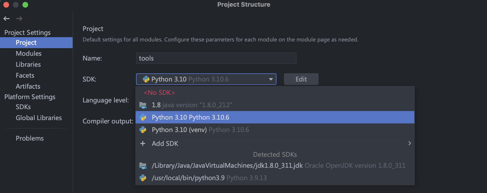
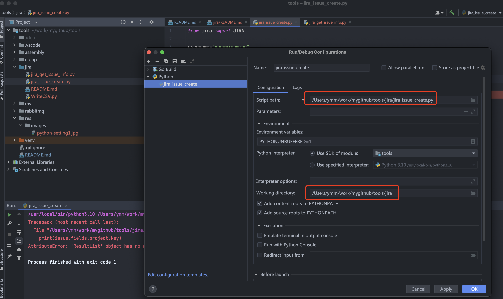

# jira工具

- ## [官方文档](https://atlassian-python-api.readthedocs.io/jira.html)  

设置python环境  

</img>

运行配置: 也可以右击文件运行  

</img>

## [获取jira信息](jira_get_issue_info.py)    

## [自动创建jira issue](jira_issue_create.py)  

